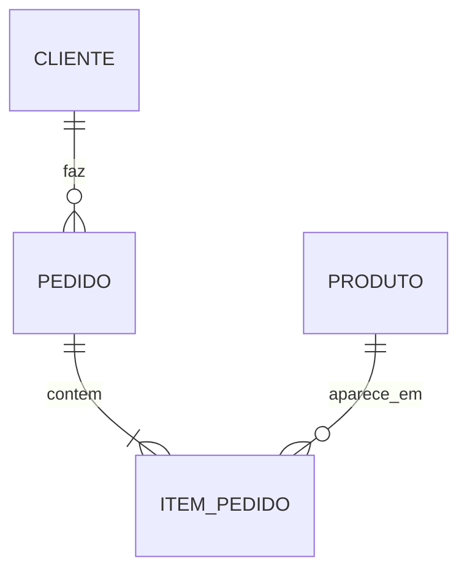

# Projeto 2: Modelagem de Banco de Dados

**Objetivo:** demonstrar que você entende estrutura, não só consulta.

## Domínio (escolha um)

- E-commerce (clientes, produtos, pedidos, pagamentos)
- Biblioteca (livros, autores, leitores, empréstimos)
- Clínica (pacientes, médicos, consultas, exames)
- Escola (alunos, cursos, turmas, notas)
- Academia (alunos, planos, aulas, frequência)

**Domínio escolhido:**

## Checklist

- [ ] Listei as entidades e regras de negócio
- [ ] Desenhei o diagrama ER (dbdiagram.io, draw.io ou Mermaid)
- [ ] Apliquei normalização até a 3FN e justifiquei decisões
- [ ] Escrevi `CREATE TABLE` com PK, FK, `NOT NULL`, `UNIQUE`, `CHECK`, `DEFAULT`
- [ ] Populei com pelo menos 50 registros coerentes
- [ ] Escrevi 10 consultas úteis (incluindo joins com 3+ tabelas)
- [ ] Criei ao menos 1 view
- [ ] Demonstrei uma transação com `ROLLBACK`
- [ ] README final preenchido

## Diagrama ER (Mermaid, o GitHub renderiza)



Substitua pelo seu modelo.

## Arquivos

```
01_schema.sql
02_dados.sql
03_consultas.sql
04_views_e_transacoes.sql
diagrama-er.png
README.md
```
